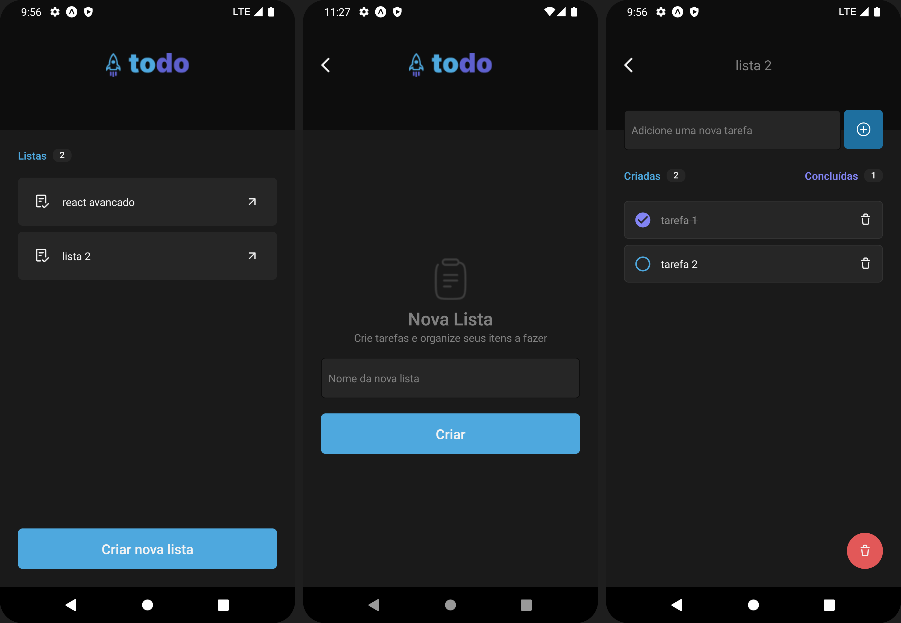

<h1 align="center"> Taks </h1>

## Sobre o projeto?

Projeto realizado para o curso de react native da [Rocketseat](https://www.rocketseat.com.br/). O projeto é um todo list onde podemos salvar tarefas, marcar como concluídas e remover tarefas concluídas e também remover a lista de tarefas.

## UI



## Sobre o Projeto

Projeto trate se de um tela de comprar de um produto onde podemos selecionar a quantidade e ingredientes extras se quisermos.
O projeto conta com uma página específica para o carrinho onde podemos remover items.

## Libs Usadas

- Expo
- styled components
- react-navigation/native

## Funcionalidades

- Home/produto

  - :heavy_check_mark: Adicionar e remover tarefas
  - :heavy_check_mark: Marcar como feitas as tarefas
  - :heavy_check_mark: Remover tarefas
  - :heavy_check_mark: Remover e cria listas

- Views

  - :heavy_check_mark: Listas
  - :heavy_check_mark: Cria nova lista
  - :heavy_check_mark: lista/tarefas

- Localstorage

  - :heavy_check_mark: Persiste o estado das tarefas em cada lista
  - :heavy_check_mark: Apaga do historico lista e tarefas

## Como Rodar

Depois de estar dentro do repositório:
Será necessário ter expo instalado e um emulador android ou podendo ler o QR code com aplicativo expo

```
npx expo start
```
